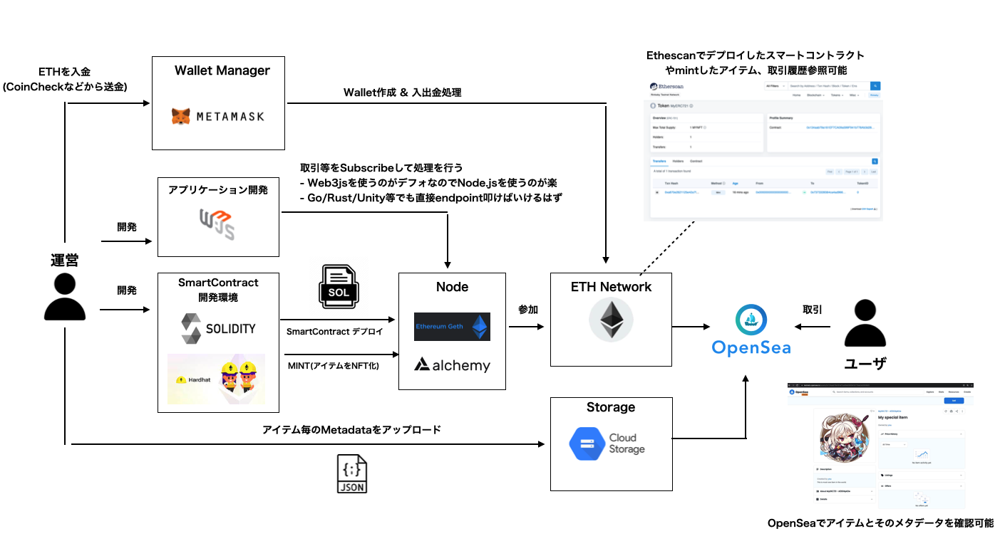
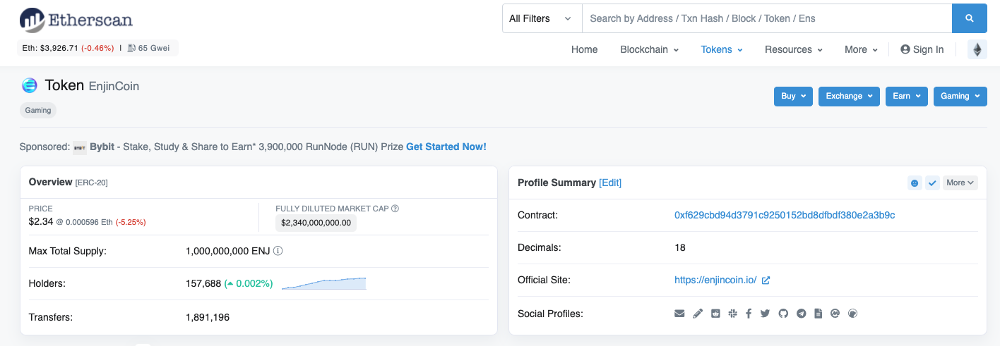
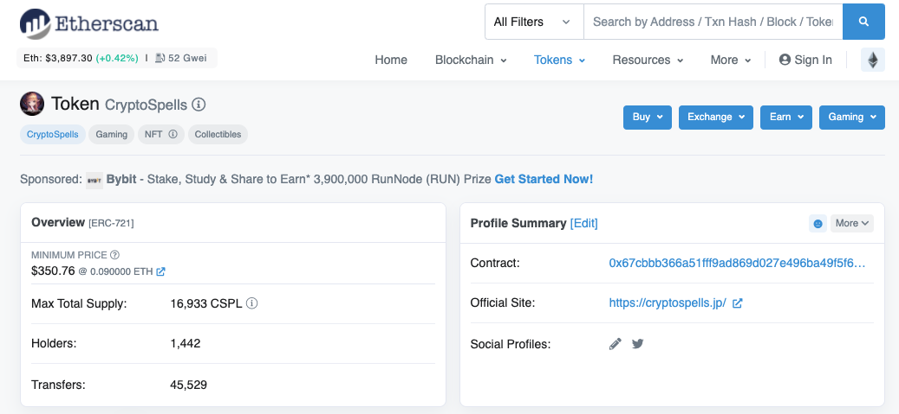
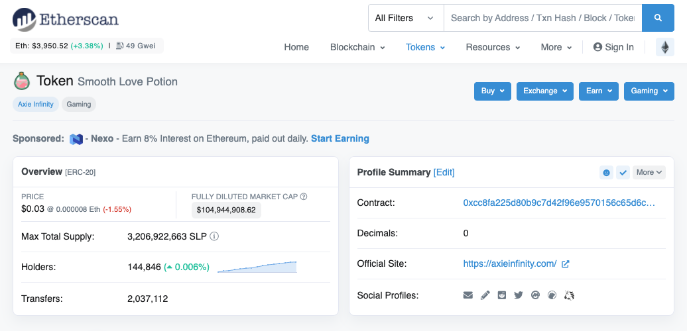
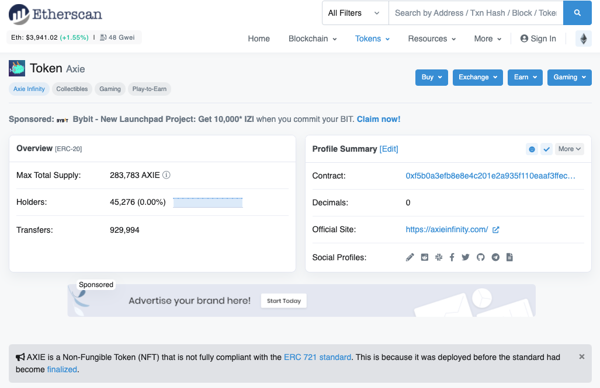

# NFTに関する調査

## コンセンサスアルゴリズムって何？
* ブロックチェーンは中央サーバで取引記録を管理するのではなく、取引記録のコピーをネットワーク参加者でコピーして検証し合うことことで取引する仕組み。
* 取引記録を分散して保持するので、取引が真正か確認するため参加者間で合意を形成する必要がある。そのルールがコンセンサスアルゴリズム。

### プルーフオブワーク(PoW)
* 取引が発生すると取引データがブロックチェーンワークに発生する。この時に取引が真正かどうか確認し新しいブロックを作る必要がある。これをネットワーク参加者がやる。
* 最初にブロックを作った人に成功報酬が与えられる。このプロセスをマイニングという。
  
* 取引記録を改竄するためには過去のブロックを全て改竄する必要があり、10minでブロックチェーン全体の半分を改竄しないといけない。
* デメリット
  - 計算量が多すぎて消費電力が膨大になっている。年間で60Twh程度（小規模な国の電力消費量よりも多いらしい）
  - 処理件数が低い。現在のビットコインでは5~10/s程度の処理性能らしい
  - 51%攻撃といわれるネットワーク参加者の半数以上の計算能力があれば乗っ取れることが明らかになっている。
* ビットコイン、イーサリアムなどが採用

### プループオブステーク(PoS)
* 暗号資産の保有量に応じてブロック作成の権利を割り当てる。 
  - 全員で計算競争しないのでPoWよりエコ。
  - 51%の計算能力持っていてもそもそも権利が割り当てられなければ乗っ取り不可
  
* 金持ち有利なので取引回数も加味するような派生)もある。
* イーサリアム2.0で採用される予定。    
  [現行イーサリアムの課題](https://hedge.guide/feature/eth-adopts-proof-of-stake-bc202106.html)

## ガス代って何？
* 取引時に発生する手数料のこと。
* 上記の通り計算者に対して報酬が必要なので、その報酬がガス代から支払われる。
* NFTのテストする時に本番イーサネットワークにデプロイするとそれだけでETHを持ってかれるので注意。

## NFTを作って発行する方法
全体図は以下  
  

1. イーサリアムに参加するためのノードを用意
   - [geth](https://geth.ethereum.org/) を使って自前で作る or 
   - [Alchemy](https://www.alchemy.com/) でノードを借りる
2. Solidityでスマートコントラクトを書いてデプロイ
   - Contractコードは[Etherscanで丸見え](https://etherscan.io/address/0xf629cbd94d3791c9250152bd8dfbdf380e2a3b9c#code) なのでWalletのPrivate Keyとか書いたら絶対ダメ。
3. アイテムのメタデータを作ってGCS等誰でも見れるストレージにアップ
4. アイテムをmintしてNFT化

[サンプル](./opensea) にテストネットワークを利用してOpenSeaに出品するまでの手順を書いておいた。

### テストネットワークとは？
* テスト専用のネットワーク。RinkebyとかGoerliなどいくつかある。ローカルにも構築できる。
* テストのためにメインネットに接続していたらガス代がとんでもないことになるので、テストネットワークでテストする。
* MetaMaskでテストネットとメインネットの切り替え可能

## NFTゲームを作るに

実際NFTゲームの運営になろうと思ったらどういう手法が考えられるのか。

| サマリ | 事例 |
| ----------- | ------------ |
| イーサリアム上でERC721のトークンを発行する| [Crypt Spells](https://cryptospells.jp/) | 
| イーサリアムサイドチェーンの構築とERC20とERC721のトークン発行 | [Axie Infinity](https://axieinfinity.com/) | 
| [Line Blockchain](https://docs-blockchain.line.biz/) に乗っかる | [資産性ミリオンアーサー](https://shisansei.million-arthurs.com/) | 

他にもエンジンコインに乗っかるなどの方法もあると思われる。  

* ERC20とかERC721って何？
  - トークンの規格のこと。
  - ERC20が通貨用、ERC721がNFTアイテム用として使われる。他にもいくつか規格がある。
  
* EnjinCoinもトークンの1種
  - ERC1155ベースのトークンであり、イーサリアムに乗っかっている。サイドチェーンなどを作っていると思われる。
    
 
### Crypt Spells

* Solidity等でERC721のスマートコントラクトを開発してイーサリアムネットワークにデプロイする。
* ガチャ等でアイテムを生成するかユーザが売買したくなったらmintする
* eventとemitの仕組みを使って取引を記録することになろう。
* transferが発生したらユーザデータの置換も必要になると思われる。

### Axie Infinity
* Axie Infinityの場合NFTアイテムだけでなくSLPという独自通貨のトークンを発行している
  - SLPがERC20の独自通過
    

  - AxieがNFTアイテムであるクリーチャー。下の方に標準じゃないERC721と書いてある。おそらくERC721が正式になる前に作られたと思われる。
    

* ゲームプレイでSLPが手に入るようになっている。
  
* MetaMaskだけでなくRonin Walletという運営が発行してるウォレットが必要
  - Ronin Walletを作る
  - MetaMaskにETHネットワーク向けのアカウントを作成する。
  - CoinCheck等からETHをMetaMaskに送信
  - MetaMaskのETHをRonin Walletに送信してRonin Networkで使えるようにする

* Ronin Network
  - Axie Inifinty専用のイーサリアム[サイドチェーン](https://hedge.guide/cryptocurrency/glossary/side-chain)  
      
    
## プライベートチェーンの作り方
* [Geth](https://github.com/ethereum/go-ethereum) を使って独自のネットワークを作る 
  - [サンプル](./privatechain) にプライベートネットワークを作って送金するところまで書いておいた。
* or [Amazon Managed Blockhain](https://aws.amazon.com/jp/managed-blockchain/) を使う。
* Amazon Managed Blockchainだとプライベートチェーンには[Hyperledger Fabric](https://docs.aws.amazon.com/managed-blockchain/latest/hyperledger-fabric-dev/managed-blockchain-get-started-tutorial.html) が使える。
  - Hyperledger FabricはETHに依存しないため、Solidityを覚える必要はなくGoやJavaでスマコンがかけるのが開発者的には嬉しい。

## サイドチェーンについて
* 本体とは別のブロックチェーンネットワークで処理を実行する。本体とはブロックチェーンブリッジで繋ぐ。
  - 必要な時だけ本体ネットワークに繋ぐだけで済ませるのでエコ
  - チャイルドチェーンとも呼ばれる（Axie Infinityだとイーサリアムがペアレント、Roninがチャイルド）
* イーサリアムへの参加者が増えるにつれてガス代高騰 & トランザクション遅延に悩まされた。それを解決するためのスケーリングソリューションの一つ
  - https://ethereum.org/ja/developers/docs/scaling/ 
* 作り方
  - 使用するスケーリングソリューション「レイヤー2ソリューション」の内容を決める（プラズマ、ロールアップ等）
  - ブロックチェーンネットワークを作る
  - 選択したソリューションを使用してメインネットに接続する
* Roninのスマートコントラクトが公開されているので、これを解析すれば同じ形で作ることができるかもしれない
  - https://github.com/axieinfinity/ronin-smart-contracts#ethereum-bridge