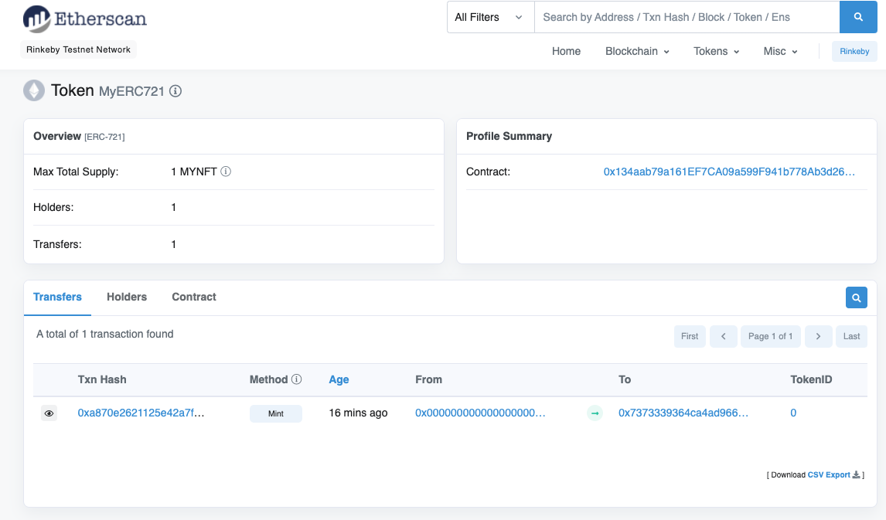

# NFT 

ERC721の商品をOpenSeaまでに出品するためのサンプル。

## Localテスト用

* ローカルプライベートネットワークを作成してデフォルトアカウントを作成する。

```
npx hardhat node
```

* `hardhat.config.js`の`local`にhardhatのhttpアドレスと上記で発行されたアカウントの秘密鍵を最低1つ追加

```
# Deploy 
## deploy 毎に 新規のコントラクトIDが作られる。以下のサイトでコントラクト見れる
## https://rinkeby.etherscan.io/address/
npx hardhat compile
npx hardhat run --network local scripts/deploy.js

# Mint 
export CONTRACT_ADDRESS=デプロイ時のログにでるコントラクトのアドレス
npx hardhat run --network local scripts/mint.js
```

## Rinkebyに接続してOpenSeaのテストネットに出品する

ローカルではなくイーサリアムのテストネットであるRinkebyを使用してOpenSeaのtestnetに出品する方法
* ブロックチェーンネットワークに参加するノードが必要。[Alchemy](https://www.alchemy.com/) を使うのが楽
* MetaMask等でブロックチェーンのウォレットを作る
* [faucets](https://faucets.chain.link/rinkeby) でETHをもらって上記のウォレットに入金する。
* `hardhat.config.js`の`rinkeby`の
    - `url`にalchemyで借りたノードのURL
    - `accounts`に上記ウォレットの秘密鍵を追加する

### Deploy

Deploy 毎に 新規のコントラクトIDが作られる。  
deployにもガス代がかかるので不足するとエラーになる。上記のfaucets等でテストETHをもらっておくこと。
```
# ERC721のメータデータを保存するURL（GCSのバケットURLなどを指定）
export RINKEBY_URL=${Alchemy等rinkedbyネットワークに参加するノード}
export RINKEBY_ACCOUNT=${MetaMask等のウォレットの秘密鍵}
export ERC721_BASE_TOKEN_URL=${GCS等Metadataを保存してあるURL} 「https://~~~/」
npx hardhat compile
npx hardhat run --network rinkeby scripts/deploy.js
```

以下のサイトでデプロイされたトークンが見れる
https://rinkeby.etherscan.io/token/${CONTRACT_ADDRESS}



### Mint

```
export CONTRACT_ADDRESS=${デプロイ時のログに出るコントラクトのアドレス}
npx hardhat run --network rinkeby scripts/mint.js
```

しばらくするとopenseaのtestnetで商品を確認できる。
https://testnets.opensea.io/assets/${CONTRACT_ADDRESS}/トークンID

